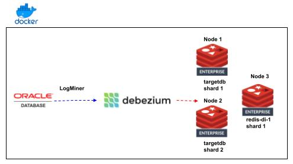
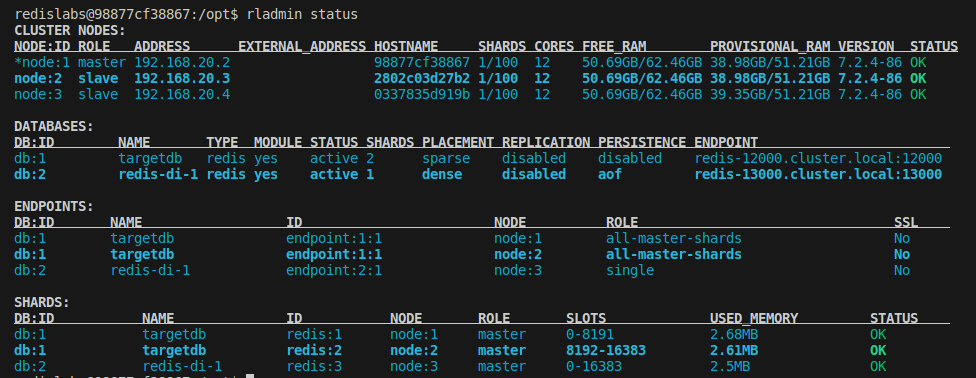
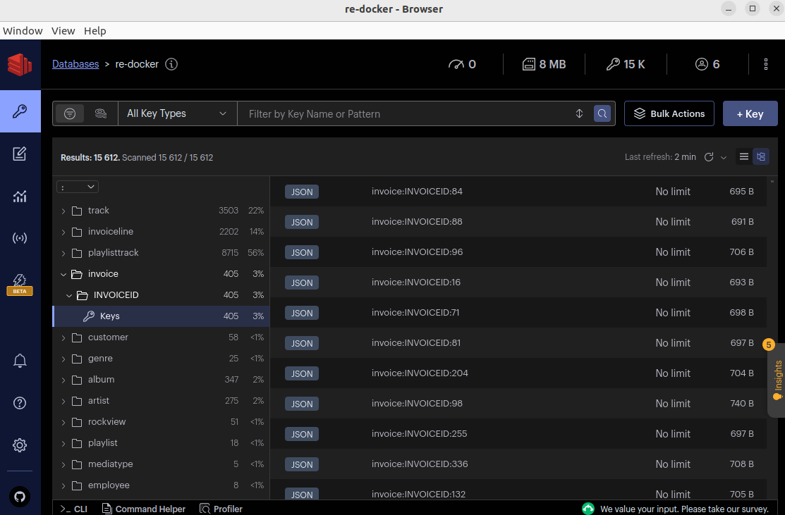
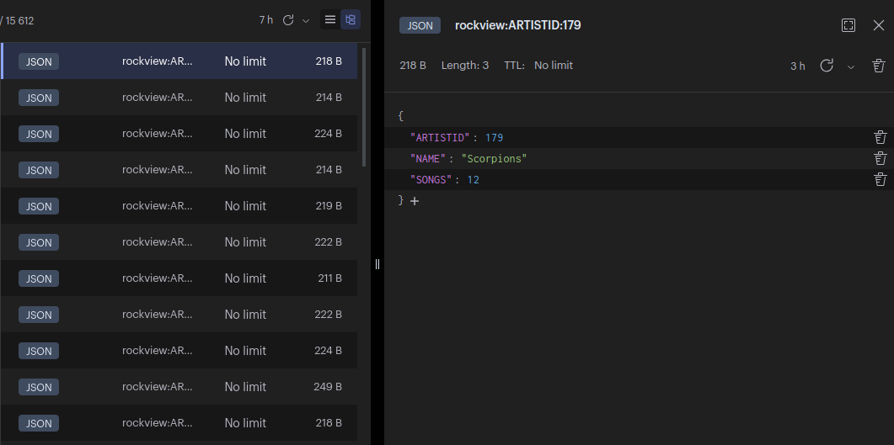
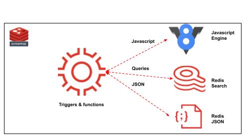

# Redis Search and SQL Query Comparisons  

## Contents
1.  [Summary](#summary)
2.  [Architecture](#architecture)
3.  [Data Set in Redis Insight](#dataset)
4.  [Features](#features)
5.  [Prerequisites](#prerequisites)
6.  [Installation](#installation)
7.  [Usage](#usage)
8.  [Scenario 1](#scenario1)
9.  [Scenario 2](#scenario2)
10. [Scenario 3](#scenario3)
11. [Scenario 4](#scenario4)
12. [Scenario 5](#scenario5)
13. [Scenario 6](#scenario6)
14. [Scenario 7](#scenario7)
15. [Scenario 8](#scenario8)

## Summary <a name="summary"></a>
This is a series of comparisons of equivalent SQL and Redis Search commands against the Chinook dataset.  Oracle Enterprise (OE) is used as the relational database with Redis Data Integration (RDI) used to populate a Redis Enterprise (RE) database via Change Data Capture (CDC.)

## Architecture <a name="architecture"></a>
 

## Redis Enterprise Config <a name="rladmin"></a>


## Data Set In RedisInsight <a name="dataset"></a>


## Features <a name="features"></a>
- Builds out a full RE with RDI and OE environment to include:  3-node RE Cluster, 1-node OE, RDI, and Debezium.

## Prerequisites <a name="prerequisites"></a>
- Ubuntu 20.x
- Docker Compose
- Docker
- Command line tools: curl, wget

## Installation <a name="installation"></a>
```bash
git clone https://github.com/Redislabs-Solution-Architects/search-sql.git && cd search-sql && npm install
```

## Usage <a name="usage"></a>
### Start
```bash
./start.sh
```
### Stop
```bash
./stop.sh
```

## Query Scenario 1 <a name="scenario1"></a>
Which countries have the most Invoices?
### SQL
#### Query
```sql
SELECT BillingCountry,
       COUNT(*)       AS Invoices 
  FROM Invoice
GROUP BY BillingCountry
ORDER BY Invoices DESC
FETCH FIRST 5 ROWS ONLY;
```
#### Result
```text
BILLINGCOUNTRY                             INVOICES
---------------------------------------- ----------
USA                                              91
Canada                                           56
France                                           35
Brazil                                           35
Germany                                          28
```
### Redis Search
#### Index
```bash
FT.CREATE idx ON JSON PREFIX 1 invoice: SCHEMA $.BILLINGCOUNTRY AS BillingCountry TAG
```
#### Query
```bash
FT.AGGREGATE idx * GROUPBY 1 @BillingCountry REDUCE COUNT 0 AS Invoices SORTBY 2 @Invoices DESC LIMIT 0 5
```
#### Result
```text
1) "23"
2) 1) "BillingCountry"
   2) "USA"
   3) "Invoices"
   4) "91"
3) 1) "BillingCountry"
   2) "Canada"
   3) "Invoices"
   4) "56"
4) 1) "BillingCountry"
   2) "Brazil"
   3) "Invoices"
   4) "35"
5) 1) "BillingCountry"
   2) "France"
   3) "Invoices"
   4) "35"
6) 1) "BillingCountry"
   2) "Germany"
   3) "Invoices"
   4) "28"
```

## Query Scenario 2 <a name="scenario2"></a>
Which city has the best customers?
### SQL
#### Query
```sql
SELECT BillingCity, SUM(Total)  AS InvoiceDollars 
FROM Invoice
GROUP BY BillingCity 
ORDER BY InvoiceDollars DESC
FETCH FIRST 7 ROWS ONLY;
```
#### Result
```text
BILLINGCITY                              INVOICEDOLLARS
---------------------------------------- --------------
Prague                                            90.24
Paris                                             77.24
Mountain View                                     77.24
Berlin                                            75.24
S??o Paulo                                        75.24
London                                            75.24
Fort Worth                                        47.62
```
### Redis Search
#### Index
```bash
FT.CREATE idx ON JSON PREFIX 1 invoice: SCHEMA $.BILLINGCITY AS BillingCity TAG $.TOTAL AS Total NUMERIC
```
#### Query
```bash
FT.AGGREGATE idx * GROUPBY 1 @BillingCity REDUCE SUM 1 @Total AS InvoiceDollars SORTBY 2 @InvoiceDollars DESC LIMIT 0 7
```
#### Result
```text
1) "52"
2) 1) "BillingCity"
   2) "Prague"
   3) "InvoiceDollars"
   4) "90.24"
3) 1) "BillingCity"
   2) "Paris"
   3) "InvoiceDollars"
   4) "77.24"
4) 1) "BillingCity"
   2) "Mountain View"
   3) "InvoiceDollars"
   4) "77.24"
5) 1) "BillingCity"
   2) "Berlin"
   3) "InvoiceDollars"
   4) "75.24"
6) 1) "BillingCity"
   2) "S\xef\xbf\xbd\xef\xbf\xbdo Paulo"
   3) "InvoiceDollars"
   4) "75.24"
7) 1) "BillingCity"
   2) "London"
   3) "InvoiceDollars"
   4) "75.24"
8) 1) "BillingCity"
   2) "Fort Worth"
   3) "InvoiceDollars"
   4) "47.62"
```

## Query Scenario 3 <a name="scenario3"></a>
Who is the best customer?
### SQL
#### Query
```sql
SELECT CustomerId, SUM(Total) AS Money_Spent 
FROM Invoice 
GROUP BY CustomerId 
ORDER BY Money_Spent DESC 
FETCH FIRST 1 ROWS ONLY;
```
#### Result
```text
CUSTOMERID MONEY_SPENT
---------- -----------
         6       49.62
```
### Redis Search
#### Index
```bash
FT.CREATE idx ON JSON PREFIX 1 invoice: SCHEMA $.CUSTOMERID AS CustomerId NUMERIC $.TOTAL AS Total NUMERIC
```
#### Query
```bash
FT.AGGREGATE idx * GROUPBY 1 @CustomerId REDUCE SUM 1 @Total AS Money_Spent SORTBY 2 @Money_Spent DESC LIMIT 0 1
```
#### Result
```text
1) "58"
2) 1) "CustomerId"
   2) "6"
   3) "Money_Spent"
   4) "49.62"
```

## Query Scenario 4 <a name="scenario4"></a>
Which tracks have a song length longer than the average song length? 
### SQL
#### Query
```sql
SELECT Name, Milliseconds
FROM Track
WHERE Milliseconds > (SELECT AVG(Milliseconds) FROM Track)
ORDER BY Milliseconds DESC
FETCH FIRST 5 ROWS ONLY; 
```
#### Result
```text
NAME                           MILLISECONDS
------------------------------ ------------
Occupation / Precipice              5286953
Through a Looking Glass             5088838
Greetings from Earth, Pt. 1         2960293
The Man With Nine Lives             2956998
Battlestar Galactica, Pt. 2         2956081
```
### Redis Search
#### Index
```bash
FT.CREATE idx ON JSON PREFIX 1 track: SCHEMA $.MILLISECONDS AS Milliseconds NUMERIC SORTABLE
```
#### Query
```bash
FT.AGGREGATE idx * GROUPBY 0 REDUCE AVG 1 @Milliseconds AS avg
FT.SEARCH idx "@Milliseconds:[393599.212104 +inf]" RETURN 2 $.NAME $.MILLISECONDS SORTBY Milliseconds DESC LIMIT 0 5
```
#### Result
```text
1) "1"
2) 1) "avg"
   2) "393599.212104"

1) "494"
2) "track:TRACKID:2820"
3) 1) "$.NAME"
   2) "Occupation / Precipice"
   3) "$.MILLISECONDS"
   4) "5286953"
4) "track:TRACKID:3224"
5) 1) "$.NAME"
   2) "Through a Looking Glass"
   3) "$.MILLISECONDS"
   4) "5088838"
6) "track:TRACKID:3244"
7) 1) "$.NAME"
   2) "Greetings from Earth, Pt. 1"
   3) "$.MILLISECONDS"
   4) "2960293"
8) "track:TRACKID:3242"
9) 1) "$.NAME"
   2) "The Man With Nine Lives"
   3) "$.MILLISECONDS"
   4) "2956998"
10) "track:TRACKID:3227"
11) 1) "$.NAME"
   2) "Battlestar Galactica, Pt. 2"
   3) "$.MILLISECONDS"
   4) "2956081"
```

## Query Scenario 5 <a name="scenario5"></a>
Find the first 5 customers by Id who are not in the US.
### SQL
#### Query
```sql
SELECT CustomerId, FirstName, LastName, Country
FROM Customer
WHERE not Country = 'USA'
ORDER BY CustomerId ASC
FETCH FIRST 5 ROWS ONLY;
```
#### Result
```text
CUSTOMERID FIRSTNAME                                LASTNAME             COUNTRY
---------- ---------------------------------------- -------------------- ----------------------------------------
         1 Lu??s                                    Gon??alves           Brazil
         2 Leonie                                   K??hler              Germany
         3 Fran??ois                                Tremblay             Canada
         4 Bj??rn                                   Hansen               Norway
         5 Franti??ek                               Wichterlov??         Czech Republic
```
### Redis Search
#### Index
```bash
FT.CREATE idx ON JSON PREFIX 1 customer: SCHEMA $.COUNTRY AS Country TAG $.CUSTOMERID AS CustomerId NUMERIC SORTABLE
```
#### Query
```bash
FT.SEARCH idx "-@Country:{USA}" RETURN 4 $.CUSTOMERID $.FIRSTNAME $.LASTNAME $.COUNTRY SORTBY CustomerId LIMIT 0 5
```
#### Result
```text
1) "45"
2) "customer:CUSTOMERID:1"
3) 1) "$.CUSTOMERID"
   2) "1"
   3) "$.FIRSTNAME"
   4) "Lu\xef\xbf\xbd\xef\xbf\xbds"
   5) "$.LASTNAME"
   6) "Gon\xef\xbf\xbd\xef\xbf\xbdalves"
   7) "$.COUNTRY"
   8) "Brazil"
4) "customer:CUSTOMERID:2"
5) 1) "$.CUSTOMERID"
   2) "2"
   3) "$.FIRSTNAME"
   4) "Leonie"
   5) "$.LASTNAME"
   6) "K\xef\xbf\xbd\xef\xbf\xbdhler"
   7) "$.COUNTRY"
   8) "Germany"
6) "customer:CUSTOMERID:3"
7) 1) "$.CUSTOMERID"
   2) "3"
   3) "$.FIRSTNAME"
   4) "Fran\xef\xbf\xbd\xef\xbf\xbdois"
   5) "$.LASTNAME"
   6) "Tremblay"
   7) "$.COUNTRY"
   8) "Canada"
8) "customer:CUSTOMERID:4"
9) 1) "$.CUSTOMERID"
   2) "4"
   3) "$.FIRSTNAME"
   4) "Bj\xef\xbf\xbd\xef\xbf\xbdrn"
   5) "$.LASTNAME"
   6) "Hansen"
   7) "$.COUNTRY"
   8) "Norway"
10) "customer:CUSTOMERID:5"
11) 1) "$.CUSTOMERID"
   2) "5"
   3) "$.FIRSTNAME"
   4) "Franti\xef\xbf\xbd\xef\xbf\xbdek"
   5) "$.LASTNAME"
   6) "Wichterlov\xef\xbf\xbd\xef\xbf\xbd"
   7) "$.COUNTRY"
   8) "Czech Republic"
```

## Query Scenario 6 <a name="scenario6"></a>
Which employees are Sales Agents?
### SQL
#### Query
```sql
SELECT LastName, FirstName FROM Employee
WHERE Employee.Title = 'Sales Support Agent';
```
#### Result
```text
LASTNAME             FIRSTNAME
-------------------- --------------------
Peacock              Jane
Park                 Margaret
Johnson              Steve
```
### Redis Search
#### Index
```bash
FT.CREATE idx ON JSON PREFIX 1 employee: SCHEMA $.TITLE AS Title TAG
```
#### Query
```bash
FT.SEARCH idx "@Title:{Sales Support Agent}" RETURN 2 $.LASTNAME $.FIRSTNAME
```
#### Result
```text
1) "3"
2) "employee:EMPLOYEEID:3"
3) 1) "$.LASTNAME"
   2) "Peacock"
   3) "$.FIRSTNAME"
   4) "Jane"
4) "employee:EMPLOYEEID:4"
5) 1) "$.LASTNAME"
   2) "Park"
   3) "$.FIRSTNAME"
   4) "Margaret"
6) "employee:EMPLOYEEID:5"
7) 1) "$.LASTNAME"
   2) "Johnson"
   3) "$.FIRSTNAME"
   4) "Steve"
```

## Query Scenario 7 <a name="scenario7"></a>
What is the count of line items for Invoice ID 37?
### SQL
#### Query
```sql
SELECT COUNT(InvoiceLineId)
FROM InvoiceLine
WHERE InvoiceId = 37;
```
#### Result
```text
COUNT(INVOICELINEID)
--------------------
                   4
```
### Redis Search
#### Index
```bash
FT.CREATE idx ON JSON PREFIX 1 invoiceline: SCHEMA $INVOICEID AS InvoiceId NUMERIC
```
#### Query
```bash
FT.AGGREGATE idx "@InvoiceId:[37 37]" GROUPBY 0 REDUCE COUNT 0 as Count
```
#### Result
```text
1) "1"
2) 1) "Count"
   2) "4"
```

## Query Scenario 8 <a name="scenario8"></a>
Which artists have written the most Rock music?
### SQL Option 1 - 4 x Table JOIN
#### Query
```sql
SELECT Artist.ArtistId AS artistId, Artist.Name AS name, COUNT(Track.Name) AS Songs 
FROM Artist 
JOIN Album ON Album.ArtistId = Artist.ArtistId 
JOIN Track ON Album.AlbumId = Track.AlbumId 
JOIN Genre ON Track.GenreId = Genre.GenreId WHERE Genre.Name = 'Rock' 
GROUP BY Artist.ArtistId, Artist.Name, Genre.Name 
ORDER BY Songs DESC 
FETCH FIRST 10 ROWS ONLY; 
```
#### Result
```text
  ARTISTID NAME                                SONGS
---------- ------------------------------ ----------
        22 Led Zeppelin                          114
       150 U2                                    112
        58 Deep Purple                            92
        90 Iron Maiden                            81
       118 Pearl Jam                              54
       152 Van Halen                              52
        51 Queen                                  45
       142 The Rolling Stones                     41
        76 Creedence Clearwater Revival           40
        52 Kiss                                   35

```
### SQL Option 2 - Materialized View
In this case, we build a materialize view of the same SELECT/JOIN above.  Debezium, and subsequently RE/RDI, can perform CDC on this view if we also turn on Logminer for the view and create a primary key.
#### View Construction
```sql
CREATE MATERIALIZED VIEW RockView
BUILD IMMEDIATE
AS
SELECT Artist.ArtistId AS artistId, Artist.Name AS name, COUNT(Track.Name) AS Songs 
FROM Artist
JOIN Album ON Album.ArtistId = Artist.ArtistId 
JOIN Track ON Album.AlbumId = Track.AlbumId 
JOIN Genre ON Track.GenreId = Genre.GenreId WHERE Genre.Name = 'Rock' 
GROUP BY Artist.ArtistId, Artist.Name, Genre.Name 
ORDER BY Songs DESC; 

ALTER TABLE CHINOOK.ROCKVIEW ADD SUPPLEMENTAL LOG DATA (ALL) COLUMNS;
ALTER MATERIALIZED VIEW RockView ADD CONSTRAINT PK_RockVIEW PRIMARY KEY (ArtistId);
```
#### Query
```sql
SELECT * FROM RockView
FETCH FIRST 10 ROWS ONLY; 
```
#### Result
```text
   ARTISTID NAME                                SONGS
---------- ------------------------------ ----------
        22 Led Zeppelin                          114
       150 U2                                    112
        58 Deep Purple                            92
        90 Iron Maiden                            81
       118 Pearl Jam                              54
       152 Van Halen                              52
        51 Queen                                  45
       142 The Rolling Stones                     41
        76 Creedence Clearwater Revival           40
        52 Kiss                                   35 
```
### Redis Search Option 1 - Materialized View CDC
In this option, we make use of the CDC of the matierialized view created above.  It's important to note this method of
performing Redis Search against an equivalent SQL JOIN will only work with Oracle.  Materialized views and/or CDC of them does not work with Postgres, MySQL, MSSQL.
#### Materialized View in RedisInsight

#### Index
```bash
FT.CREATE idx ON JSON PREFIX 1 rockview: SCHEMA $.SONGS AS SONGS NUMERIC SORTABLE
```
#### Query 
```bash
FT.SEARCH idx * SORTBY SONGS DESC LIMIT 0 10
```
#### Result
```text
1) "51"
2) "rockview:ARTISTID:22"
3) 1) "SONGS"
   2) "114"
   3) "$"
   4) "{\"ARTISTID\":22,\"NAME\":\"Led Zeppelin\",\"SONGS\":114}"
4) "rockview:ARTISTID:150"
5) 1) "SONGS"
   2) "112"
   3) "$"
   4) "{\"ARTISTID\":150,\"NAME\":\"U2\",\"SONGS\":112}"
6) "rockview:ARTISTID:58"
7) 1) "SONGS"
   2) "92"
   3) "$"
   4) "{\"ARTISTID\":58,\"NAME\":\"Deep Purple\",\"SONGS\":92}"
8) "rockview:ARTISTID:90"
9) 1) "SONGS"
   2) "81"
   3) "$"
   4) "{\"ARTISTID\":90,\"NAME\":\"Iron Maiden\",\"SONGS\":81}"
10) "rockview:ARTISTID:118"
11) 1) "SONGS"
   2) "54"
   3) "$"
   4) "{\"ARTISTID\":118,\"NAME\":\"Pearl Jam\",\"SONGS\":54}"
12) "rockview:ARTISTID:152"
13) 1) "SONGS"
   2) "52"
   3) "$"
   4) "{\"ARTISTID\":152,\"NAME\":\"Van Halen\",\"SONGS\":52}"
14) "rockview:ARTISTID:51"
15) 1) "SONGS"
   2) "45"
   3) "$"
   4) "{\"ARTISTID\":51,\"NAME\":\"Queen\",\"SONGS\":45}"
16) "rockview:ARTISTID:142"
17) 1) "SONGS"
   2) "41"
   3) "$"
   4) "{\"ARTISTID\":142,\"NAME\":\"The Rolling Stones\",\"SONGS\":41}"
18) "rockview:ARTISTID:76"
19) 1) "SONGS"
   2) "40"
   3) "$"
   4) "{\"ARTISTID\":76,\"NAME\":\"Creedence Clearwater Revival\",\"SONGS\":40}"
20) "rockview:ARTISTID:52"
21) 1) "SONGS"
   2) "35"
   3) "$"
   4) "{\"ARTISTID\":52,\"NAME\":\"Kiss\",\"SONGS\":35}"
```
### Redis Search Option 2 - Redis Function
In this option, we use a Redis Function to perform the data gathering.  The function is written in Javascript and executes in a V8 interpreter on Redis.

 

### Index - Javascript Snippet
```javascript
    try { 
        await redis.ft.create(GENRE_INDEX, {
            '$.NAME': {
                type: SchemaFieldTypes.TAG,
                AS: 'name'
            }
            },{ ON: 'JSON', PREFIX: 'genre:' }
        );
        await poll(redis, GENRE_INDEX);
    }
    catch (err) {
        if (err.message !== 'Index already exists') {
            console.error(err);
            process.exit(1);
        }    
    } 
    
    try {
        await redis.ft.create(TRACK_INDEX, {
            '$.GENREID': {
                type: SchemaFieldTypes.NUMERIC,
                AS: 'genreId'
            }
            },{ ON: 'JSON', PREFIX: 'track:' }
        ); 
        await poll(redis, TRACK_INDEX);
    }
    catch (err) {
        if (err.message !== 'Index already exists') {
            console.error(err);
            process.exit(1);
        }
    }
```
### Function Execution
```bash
TFCALLASYNC artist.fetch 0 Rock 10
```
### Result
```text
1) 1) "ARTISTID"
   2) "22"
   3) "SONGS"
   4) "114"
   5) "NAME"
   6) "Led Zeppelin"
2) 1) "SONGS"
   2) "112"
   3) "ARTISTID"
   4) "150"
   5) "NAME"
   6) "U2"
3) 1) "NAME"
   2) "Deep Purple"
   3) "ARTISTID"
   4) "58"
   5) "SONGS"
   6) "92"
4) 1) "ARTISTID"
   2) "90"
   3) "NAME"
   4) "Iron Maiden"
   5) "SONGS"
   6) "81"
5) 1) "NAME"
   2) "Pearl Jam"
   3) "ARTISTID"
   4) "118"
   5) "SONGS"
   6) "54"
6) 1) "NAME"
   2) "Van Halen"
   3) "ARTISTID"
   4) "152"
   5) "SONGS"
   6) "52"
7) 1) "ARTISTID"
   2) "51"
   3) "SONGS"
   4) "45"
   5) "NAME"
   6) "Queen"
8) 1) "ARTISTID"
   2) "142"
   3) "NAME"
   4) "The Rolling Stones"
   5) "SONGS"
   6) "41"
9) 1) "ARTISTID"
   2) "76"
   3) "NAME"
   4) "Creedence Clearwater Revival"
   5) "SONGS"
   6) "40"
10) 1) "ARTISTID"
   2) "52"
   3) "NAME"
   4) "Kiss"
   5) "SONGS"
   6) "35"
```